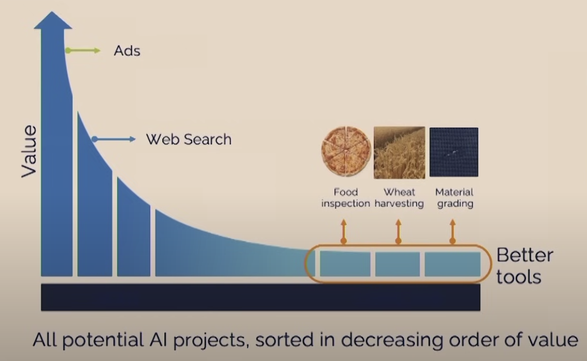

In this [talk](https://www.youtube.com/watch?v=5p248yoa3oE), we'll explore several key aspects of AI:

- Trends in AI Technologies and Tools**
- Supervised Learning
- Generative AI
- The Adoption of AI
- Opportunities in AI
- Process for Building Startups
- AI Risks and Social Impact

### Key Takeaways

During the discussion, the focus was primarily on what Andrew considers to be the two most crucial tools in AI:

1. Supervised Learning
2. Generative AI

One intriguing concept introduced was the idea of building defensible businesses, as famously articulated by Peter Thiel:

> "In the real world outside economic theory, every business is successful exactly to the extent that it does something others cannot."

Andrew expressed the hope that the continued growth of AI can lead to providing deep and lasting value.

A noteworthy observation was made regarding problem distribution, with the majority of AI applicability clustering on the left end of the graph. This situation reminds me of the 80:20 rule.