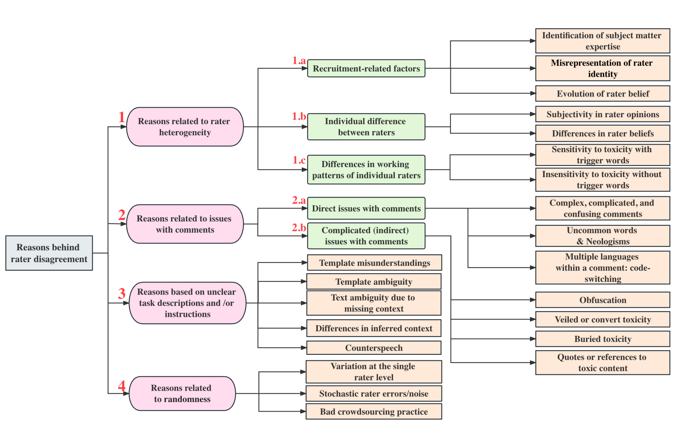

News from February 2024 that caught my attention covers content ranging from leveraging symmetry to enhance model performance, ensuring stability in AI chatbots, and addressing security concerns with GenAI Security Testing, to the importance of high-quality human data.

<!--more-->

## [How symmetry can come to the aid of machine learning](https://news.mit.edu/2024/how-symmetry-can-aid-machine-learning-0205)
- "Weyl’s law, conceived about a century before the boom in machine learning, had traditionally been applied to very different physical situations — such as those concerning the vibrations of a string or the spectrum of electromagnetic (black-body) radiation given off by a heated object."
- "Exploit a dataset’s intrinsic symmetries in order to reduce the complexity of machine learning tasks." Eg. Given an image detection algorithm, we don't need to fuss over an object's position in the image, "whether it’s exactly in the center or off to the side — and whether it is pointed right-side up, upside down, or oriented at a random angle. An algorithm equipped with the latter capability can take advantage of the symmetries of translation and rotations."
- Pros: Helpful when there is low training data.

## [A new way to let AI chatbots converse all day without crashing](https://news.mit.edu/2024/new-way-let-ai-chatbots-converse-all-day-without-crashing-0213)
- "Researchers developed a simple yet effective solution for a puzzling problem that can worsen the performance of large language models such as ChatGPT."
- "Their method involves a tweak to the key-value cache (which is like a conversation memory) at the core of many large language models. In some methods, when this cache needs to hold more information than it has capacity for, the first pieces of data are bumped out. This can cause the model to fail. By ensuring that these first few data points remain in memory, the researchers’ method allows a chatbot to keep chatting no matter how long the conversation goes". Keeping an "attention sink" on the first token ensures stable memory usage and performance, even when processing texts up to 4 million tokens in length.
- Limitations: "The model cannot remember words that aren’t stored in the cache. In the future, the researchers plan to target this limitation by investigating methods to retrieve tokens that have been evicted or enable the model to memorize previous conversations."
- Technique: StreamingLLM

## [‘GenAI Security Testing’](https://siliconangle.com/2024/02/13/akto-unveils-genai-security-testing-enhance-ai-llm-security/)
- "AKto’s GenAI Security Testing solution identifies vulnerabilities in the security measures for sanitizing the output of LLMs. The service detects attempts to inject malicious code for remote execution, cross-site scripting and other attacks that could allow attackers to extract session tokens and system information. Akto also tests whether the LLMs are susceptible to generating false or irrelevant reports."

## [Thinking about High-Quality Human Data](https://lilianweng.github.io/posts/2024-02-05-human-data-quality/)
- Detailed diagram of actions that target qualities attributes to improve on when collecting data with human annotators. 
- Detailed overview of different practises to find reliable ground truth when collecting multiple labels from multiple annotators, some taking into account of someone acting like a "spammer". Examples include Majority Voting, [Raw Agreement](https://aclanthology.org/P10-1070/), [Cohen's Kappa](https://www.jstor.org/stable/2529310), [Probabilistic Graph Modeling](https://en.wikipedia.org/wiki/Graphical_model), [MACE](https://aclanthology.org/N13-1132) (goal to identify "spammers")
- Detailed methods to help identify mislabelled data, e.g., [Influence Functions](https://www.jstor.org/stable/2285666), [Data Maps](https://arxiv.org/abs/2009.10795), [Noisy Cross-Validation](https://arxiv.org/abs/1905.05040).
- [Mariya Toneva et al. (2019)](https://arxiv.org/abs/1812.05159) found that class labels that were consistent across training epoch were never forgotten once learnt. As opposed to noisy labels or images with “uncommon” features (visually complicated to classify) are among the most forgotten examples. The experiments empirically validated that unforgettable examples can be safely removed without compromising model performance.
- [Aroyo & Welty (2015)](https://ojs.aaai.org/aimagazine/index.php/aimagazine/article/view/2564) discussed a set of “myths” in the practice of human annotation collection and found all of them somewhat inaccurate, key findings including:
    - Often there is more than one correct interpretation for some samples. We need diverse perspectives via e.g. having multiple people to review annotation quality.
    - Disagreement is not always bad. We should reduce disagreements caused by errors or poorly designed process but other disagreements can give us rich information.
    - If it is caused by a task not well defined, we should enhance the instruction. 
    - However, a more detailed guideline does not resolve innate diversity among opinions.
    - Experts may not always be better than lay people, but they would have a big gap in terms of considering what’s important.
    - Ground truth annotations can change in time, especially those related to timely events or news.

Fig. 1. A taxonomy of causes for rater disagreement. (Image source: [Zhang et al. 2023](https://arxiv.org/abs/2311.04345))
