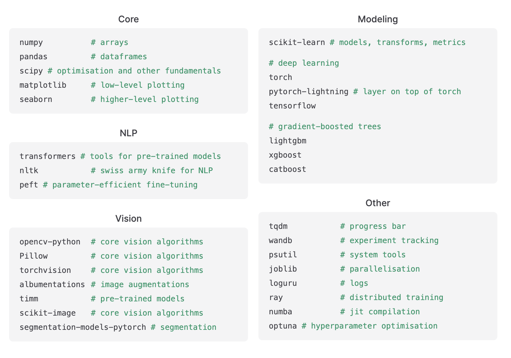
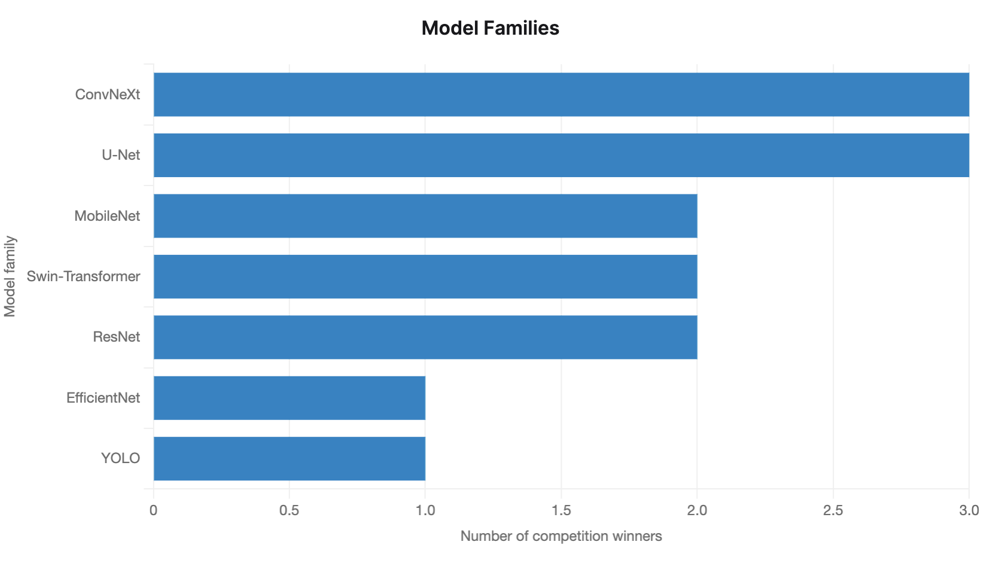

---
title: "March '24 News"
date: 2024-03-13T16:01:26+12:00
draft: false
tags: ["ai"]
categories: ["tech"]
---

News from March 2024 that caught my attention.

<!--more-->

## The State of Competitive Machine Learning

[This article](https://mlcontests.com/state-of-competitive-machine-learning-2023/) summarizes the current best techniques that have won machine learning contests ranging from NLP, Computer Vision, and Forecasting.

### Python Toolkit

Many of the top packages used by winners have remained the same. 2023's top packages are listed below, in descending order of popularity within each category.

### Computer Vision:

- Unlike in NLP, leading computer vision models still largely hadn’t converged on a single architecture.
- Things looked similar throughout 2023: both CNNs (convolutional neural networks) and Transformers were used for vision, and most competition winners still used CNN-based architectures.
- This lack of architectural convergence is backed up by research — a [2023 paper compared NFNets (a CNN-based architecture) against Vision Transformers](https://arxiv.org/abs/2310.16764?ref=mlcontests), and found that “NFNets match the reported performance of Vision Transformers with comparable compute budgets.”
- The winner of DrivenData’s Tick Tick Bloom competition, where participants used satellite imagery to detect specific types of bacteria in bodies of water, showed that deep learning isn’t necessarily the right tool for all computer vision problems. Their solution used a combination of k-nearest-neighbors and a LightGBM model, with features including climate data and the color of the water. They noted: “I tried using a CNN model with satellite images. Unfortunately, this type of model resulted in very high RMSEs. After some analysis, I suspect that the quality and resolution of the satellite images, as well as the accuracy of the positions, made it very difficult to fit the CNN model well.”
- Popular Working Toolkits:

### Reading List

- Apple's MM1 Unleashed: [MM1: Methods, Analysis & Insights from Multimodal LLM Pre-training](https://arxiv.org/pdf/2403.09611.pdf).
-  This [article](https://towardsdatascience.com/the-math-behind-adam-optimizer-c41407efe59b) dives deep into the mathematical details of the Adam optimization algorithm used in training neural network.