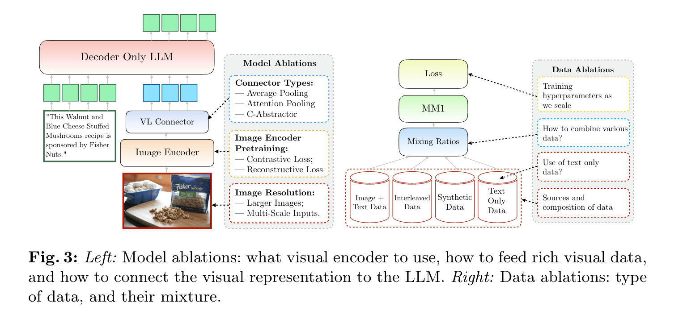
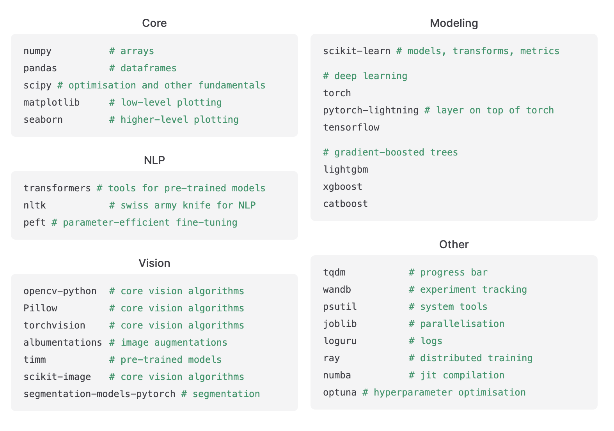
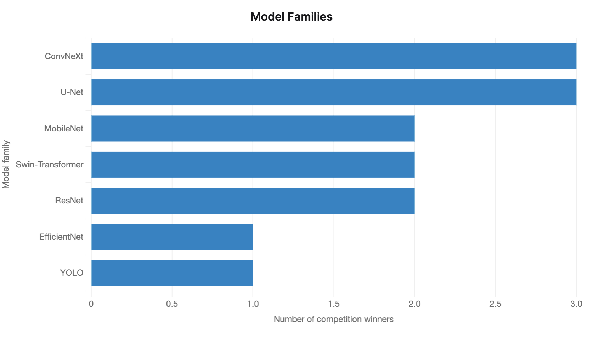

---
title: "March '24 News"
date: 2024-03-13T16:01:26+12:00
draft: true
tags: ["ai"]
categories: ["tech"]
---

News from March 2024 that caught my attention.

<!--more-->

## Apple's MM1 Latest Research
[MM1: Methods, Analysis & Insights from Multimodal LLM Pre-training](https://arxiv.org/pdf/2403.09611.pdf).

A comphrehendsive study on building high-performance Multimodal Large Language Models (MLLMs) by exploring various architectural design choices and data choices, and drawing conclusions about their impact on model efficacy. Their results identify key design principles through comprehensive ablations, focusing on the importance of image encoder choices, the mix of pre-training data (image-caption, interleaved image-text, and text-only data), and the effects of these on achieving state-of-the-art results in few-shot settings across multiple benchmarks. 

"we analyze components that enable an LLM to process visual data. Specifically, we investigate (1) how to best pre-train a visual encoder, and (2) how to bridge the visual features to the space of the LLM (see Figure 3, left)."

### design decision - architecture

They explore varying ways of connecting LLMs with different pre-trained image encoder.

For the architecture part, they start by looking at the image encoder and the key lesson is “Image resolution has the highest impact, followed by model size and training data composition”. 

Vision Language Connector Lesson ((the component that translates the visual content to the space of the LLM)): Number of visual tokens and image resolution matters most, while the type of VL connector has little effect.

Architecture of the VL connection doesn't matter.

“However, contrary to what has been reported in the literature [12], different architectural designs do not appear to conclusively produce stronger models” ([McKinzie et al., 2024, p. 7](zotero://select/library/items/TLP68ZN9)) ([pdf](zotero://open-pdf/library/items/ZNCGRJLK?page=7&annotation=XF72LYWD))

“After instruction tuning, all three architectures achieve very similar results at the 336px and 144 token setting. (See Appendix Figure 10 for fine-tuning results.)” ([McKinzie et al., 2024, p. 8](zotero://select/library/items/TLP68ZN9)) ([pdf](zotero://open-pdf/library/items/ZNCGRJLK?page=8&annotation=29SUJA6W))

### design decision - data

"The next ablation, tries to understand the significance of the pre-training data mix. MLLMs require a diverse and comprehensive dataset to learn from, encompassing image-caption pairs, interleaved image-text documents, and text-only data. "

“We consider different types of data and their relative mixture weights.” 

“Typically, models are trained in two stages, pre-training and instruction tuning. In the former stage web-scale data is used while in the latter stage task-specific curated data is utilized. In the following, we focus on the pre-training stage and elaborate our data choices (see Figure 3, right)” ([McKinzie et al., 2024, p. 8](zotero://select/library/items/TLP68ZN9)) ([pdf](zotero://open-pdf/library/items/ZNCGRJLK?page=8&annotation=CVQUTTCG))

"Interleaving text and image data improves few shot performance, but image captioning data improves zero-shot numbers."

“Data Lesson 1: Interleaved data is instrumental for few-shot and textonly performance, while captioning data lifts zero-shot performance.” ([McKinzie et al., 2024, p. 8](zotero://select/library/items/TLP68ZN9)) ([pdf](zotero://open-pdf/library/items/ZNCGRJLK?page=8&annotation=89KVB4VD))

“since interleaved data naturally contains multiple images and accompanying text which are often interrelated, such data is inherently similar to few-shot test inputs, which aligns well” ([McKinzie et al., 2024, p. 8](zotero://select/library/items/TLP68ZN9)) ([pdf](zotero://open-pdf/library/items/ZNCGRJLK?page=8&annotation=KDL3BN4R))

“Data Lesson 2: Text-only data helps with few-shot and text-only performance.” ([McKinzie et al., 2024, p. 9](zotero://select/library/items/TLP68ZN9)) ([pdf](zotero://open-pdf/library/items/ZNCGRJLK?page=9&annotation=NZTBBWWQ))

“Careful mixture of image and text data can yield optimal multimodal performance and retain strong text performance”
“Synthetic data helps with few-shot learning”

"Synthetic datasets substantially (1%+) increase performance for Image Encoder Pre-training"

"Synthetic captioning data helps substantially at this point too (up to 4% gain)"

### results

"Through extensive ablations to find out the most important design decisions for MLLMs, the authors propose a new family of multimodal models MM1 (up to 30B parameters) that achieves very good results. novel strategy for developing artificial intelligence (AI) systems that are more flexible and clever.  Apple claims that the MM1 model sets a new standard in AI’s ability to perform tasks like image captioning, visual question answering, and natural language inference with a high degree of accuracy by using a diverse dataset that includes image-caption pairs, interleaved image-text documents, and text-only data. (image encoder very important, vision-language connector less so). The release of MM1 by Apple contributes significantly to the artificial intelligence domain, offering a detailed roadmap for the development of future MLLMs. By sharing the insights and design principles gleaned from MM1, Apple not only challenges the current capabilities of models like ChatGPT but also invites the broader AI community to build upon their findings, potentially leading to more sophisticated and capable AI systems.
Congrats to the authors for their work!"
 

## The State of Competitive Machine Learning

[This article](https://mlcontests.com/state-of-competitive-machine-learning-2023/) summarizes the current best techniques that have won machine learning contests ranging from NLP, Computer Vision, and Forecasting.

### Python Toolkit

Many of the top packages used by winners have remained the same. 2023's top packages are listed below, in descending order of popularity within each category.

### Computer Vision:

- Unlike in NLP, leading computer vision models still largely hadn’t converged on a single architecture.
- Things looked similar throughout 2023: both CNNs (convolutional neural networks) and Transformers were used for vision, and most competition winners still used CNN-based architectures.
- This lack of architectural convergence is backed up by research — a [2023 paper compared NFNets (a CNN-based architecture) against Vision Transformers](https://arxiv.org/abs/2310.16764?ref=mlcontests), and found that “NFNets match the reported performance of Vision Transformers with comparable compute budgets.”
- The winner of DrivenData’s Tick Tick Bloom competition, where participants used satellite imagery to detect specific types of bacteria in bodies of water, showed that deep learning isn’t necessarily the right tool for all computer vision problems. Their solution used a combination of k-nearest-neighbors and a LightGBM model, with features including climate data and the color of the water. They noted: “I tried using a CNN model with satellite images. Unfortunately, this type of model resulted in very high RMSEs. After some analysis, I suspect that the quality and resolution of the satellite images, as well as the accuracy of the positions, made it very difficult to fit the CNN model well.”
- Popular Working Toolkits:

### Reading List
-  This [article](https://towardsdatascience.com/the-math-behind-adam-optimizer-c41407efe59b) dives deep into the mathematical details of the Adam optimization algorithm used in training neural network.